# HireSense – AI Resume Analyzer & Recruitment Platform

## Overview

HireSense is a full-stack MERN recruitment platform that helps students analyze resumes, evaluate ATS scores, compare profiles, discover matching job opportunities, and connect with recruiters through a modern hiring workflow.

## Features

* ATS Resume Analysis
* Resume Parsing & Keyword Extraction
* Job Role Matching
* Resume Comparison
* Skill Gap Analysis
* Candidate Ranking
* Recruiter Dashboard
* Job Application Portal
* GitHub Profile Integration
* Interview Question Generator
* JWT Authentication
* Role-Based Access Control (RBAC)
* Analytics Dashboard using Recharts

## Screenshots

### Landing Page

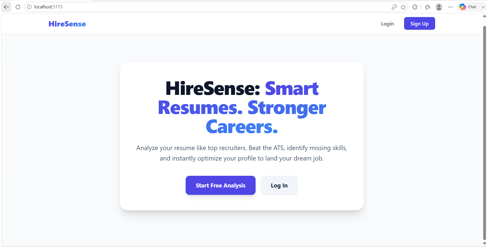

### ATS Score Analysis

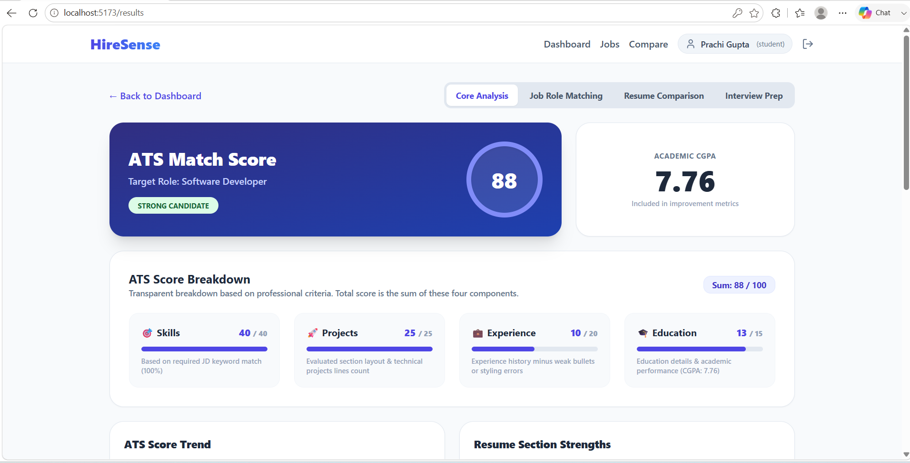

### Resume Comparison

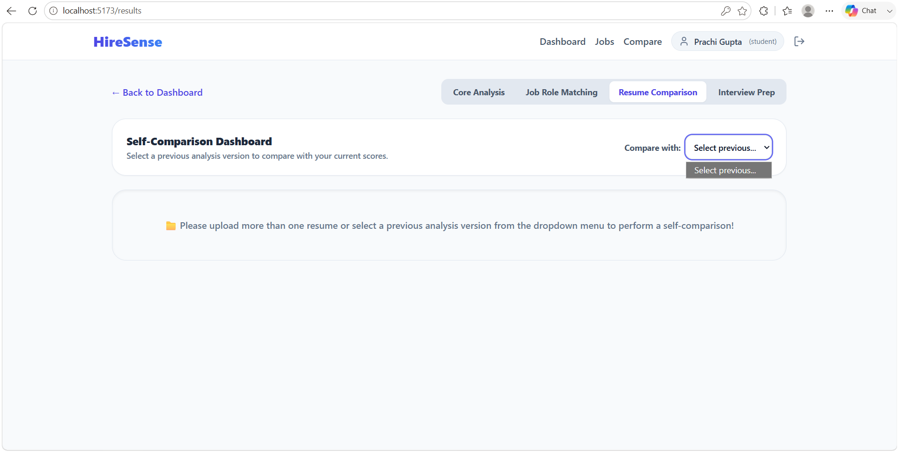

### Recruiter Dashboard

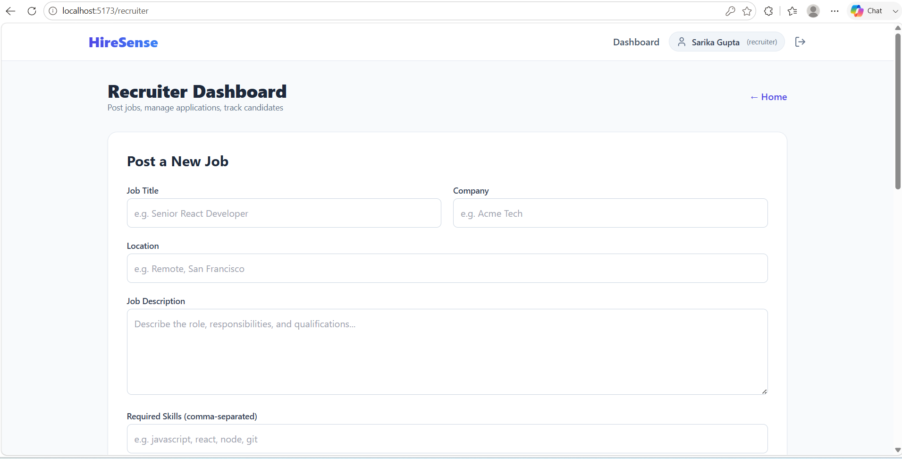

### Job Matching

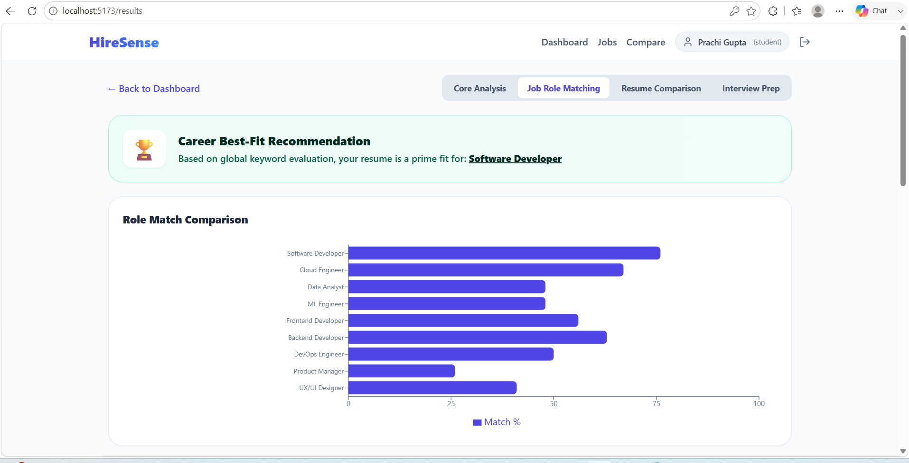

### Skill Analysis

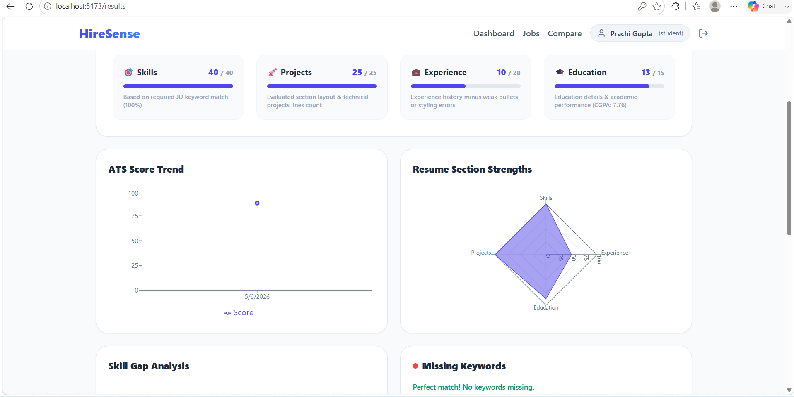

### Student Dashboard

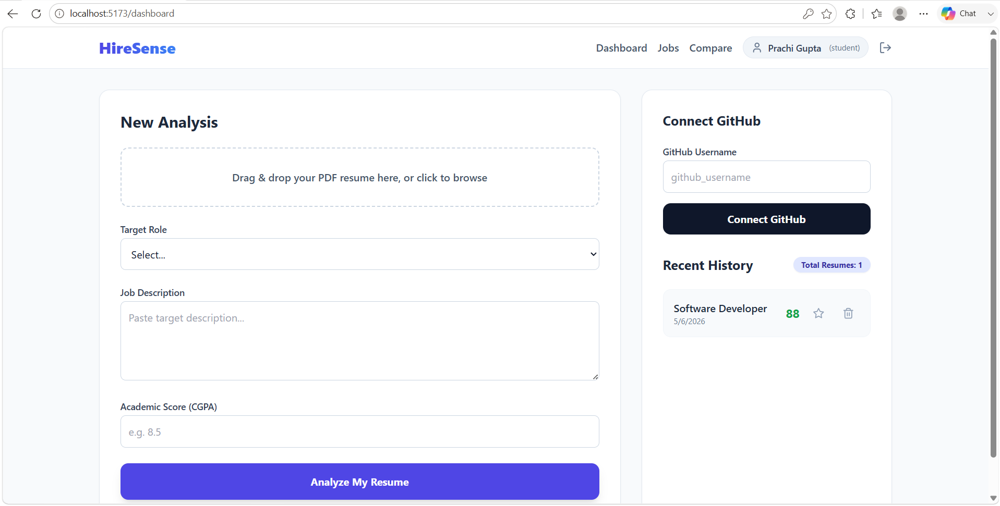

### Student Profile

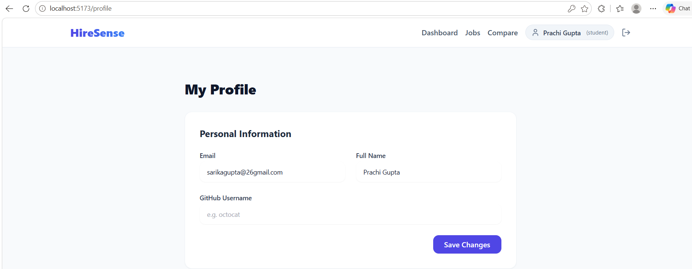

### Student Login Credentials

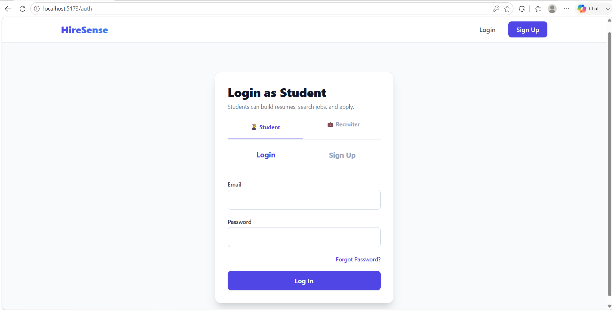

### Recruiter Profile

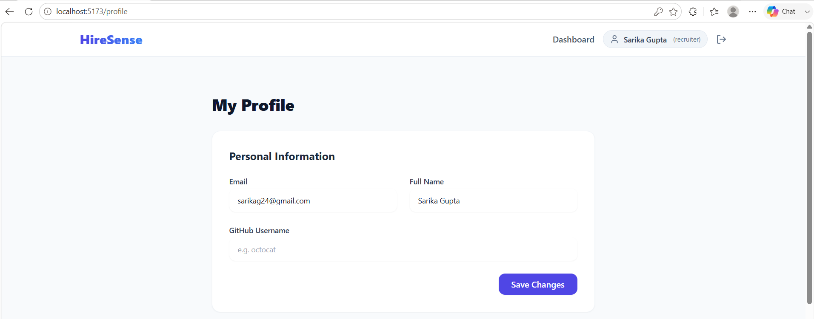

### Recruiter Login Credentials

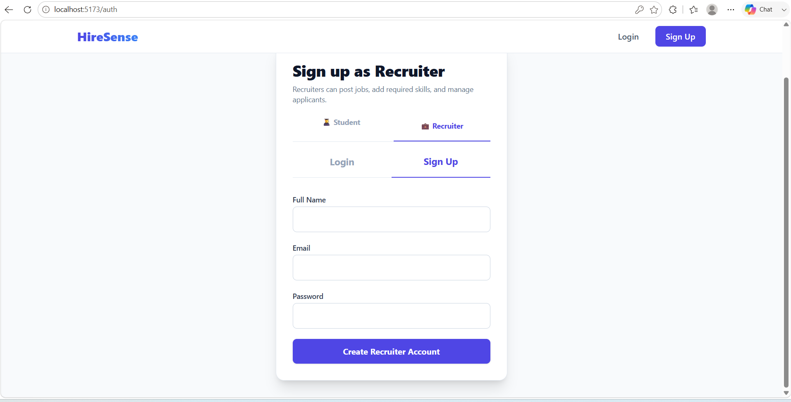

### Recruiter Applications Received

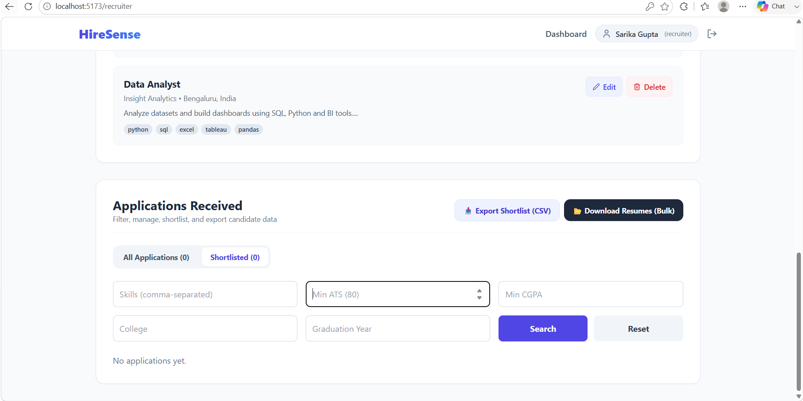

### Recruiter Posted Jobs

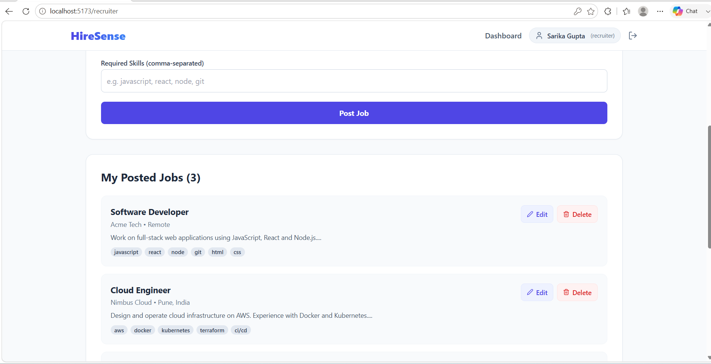

### Recruiter Security Credentials

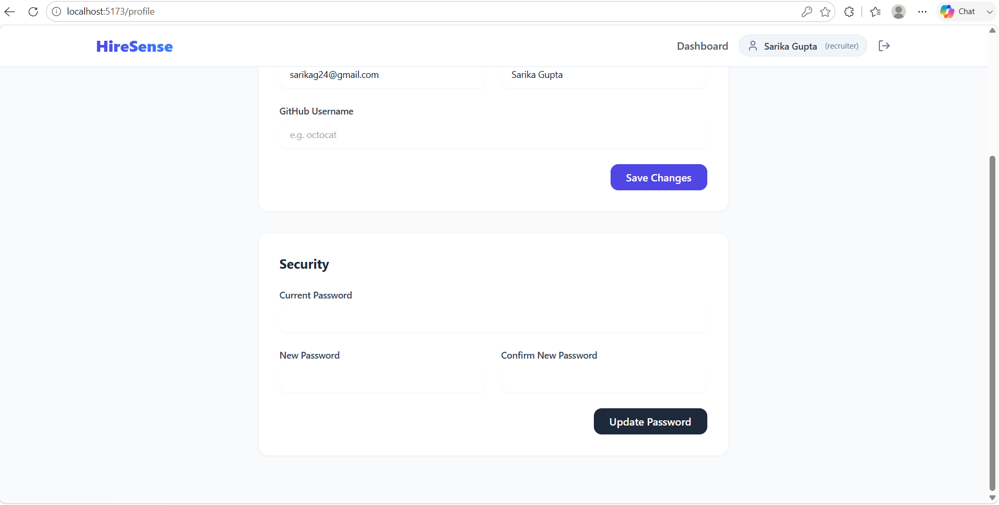

### All Job Roles

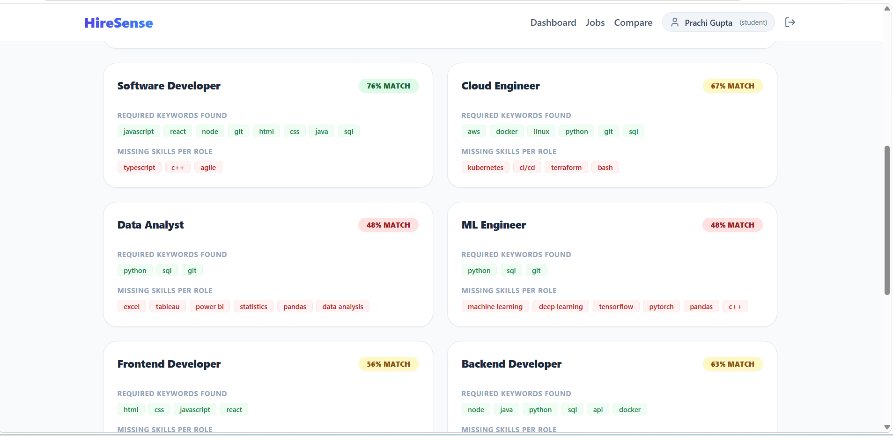

### Job Roles

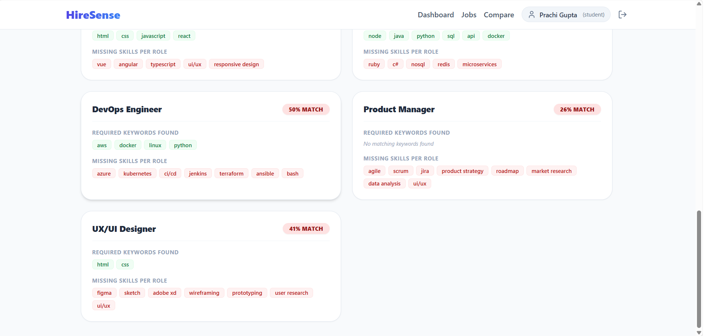

### Interview Prep

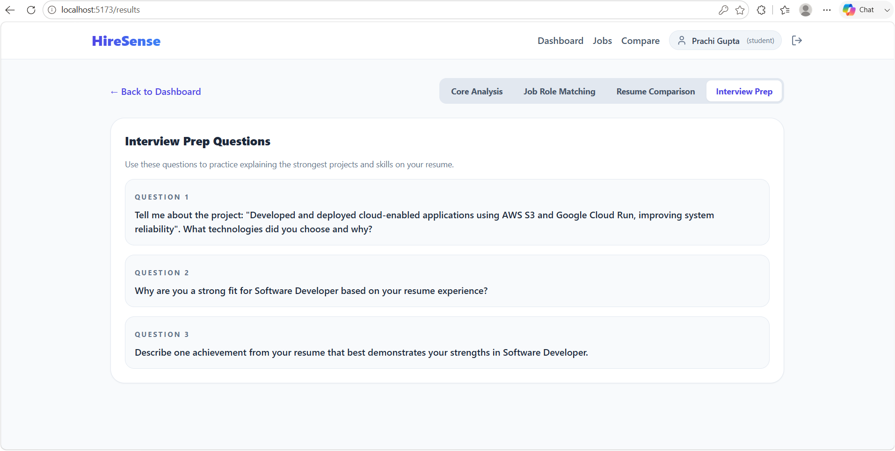

### Profile Security

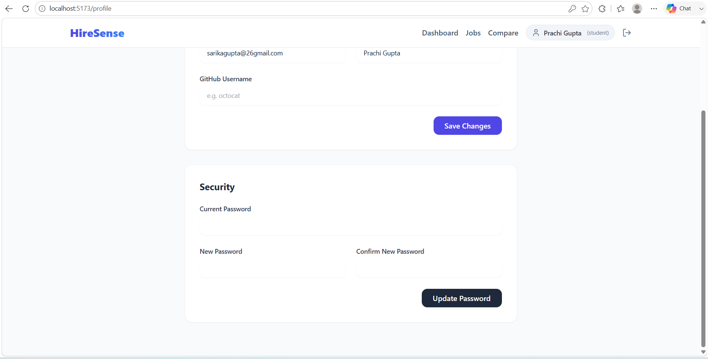

### Skills

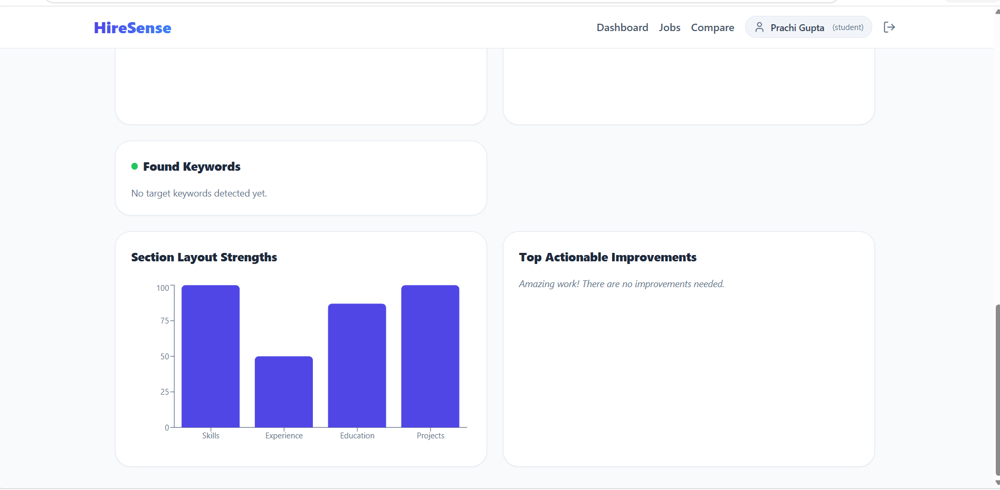


## Tech Stack

### Frontend

* React.js
* Tailwind CSS
* Recharts
* Axios

### Backend

* Node.js
* Express.js
* JWT Authentication
* Multer
* PDF-Parse

### Database

* MongoDB Atlas
* JSON Fallback Database

## Project Structure

```text
client/
server/
README.md
```

## Installation

### Backend

```bash
cd server
npm install
npm run dev
```

### Frontend

```bash
cd client
npm install
npm run dev
```

## Environment Variables

```env
PORT=5000
JWT_SECRET=your_secret_key
MONGO_URI=your_mongodb_uri
```

## Future Enhancements

* ATS Score Breakdown
* Application Status Tracking
* Recruiter Shortlisting
* Notification System

## Author

Prachi Gupta
